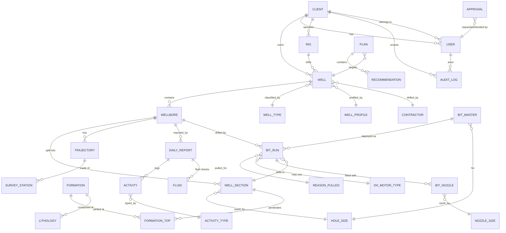

# DrillIQ — Data Model (WITSML-aligned, PostgreSQL)

> Drill-bit performance & daily-drilling-report (DDR) analytics platform.
> Persistence: **PostgreSQL** via **Prisma ORM** (`/db`). UUID primary keys everywhere.
> Multi-tenant isolation: **Postgres Row-Level Security (RLS)** + app-layer scoping (see
> [Contractor isolation](#contractor-isolation)).
> Reference vocabulary below is grounded in real NIDC / Iranian field data extracted into
> `/db/seed-data/*.json` (source: `new.sqlite`). Legacy TEXT codes are preserved as
> `legacy_code` columns and mapped to UUID PKs at seed time.

This document is the canonical entity catalogue. It defines every core entity, its purpose,
key fields with types, relationships, RLS / client-scoping requirements, and the mapping to
the **WITSML** energistics data objects we will integrate against later.

---

## Table of contents

1. [Conventions](#conventions)
2. [ER overview](#er-overview)
3. [Core entities](#core-entities)
4. [Lookup tables](#lookup-tables)
5. [WITSML mapping notes](#witsml-mapping-notes)
6. [Contractor isolation](#contractor-isolation)

---

## Conventions

| Rule | Value |
|------|-------|
| Primary keys | `uuid` (`@id @default(uuid())`), column `id` |
| Timestamps | `created_at timestamptz default now()`, `updated_at timestamptz @updatedAt` |
| Soft tenancy column | `client_id uuid` on every **client-scoped** entity |
| Money | `numeric(14,2)` (USD) |
| Depths / lengths | `numeric(10,2)` **meters** (SI stored & computed; converted to ft for display at the UI only — see domain-formulas.md §13). Imperial units in this doc tagged `ft`/`ft-lbf`/`ft/hr` are **formula I/O or output labels**, not the storage unit. |
| Engineering scalars (MSE, ROP, WOB…) | `numeric(12,4)` |
| Enumerations with stable codes | Postgres `enum` for RBAC/status; **lookup tables** for drilling vocabulary that ops staff curate |
| Naming | tables `snake_case` plural; Prisma models `PascalCase` singular |

**Client-scoped** = the row belongs to exactly one tenant and is subject to RLS. These tables
**must** carry `client_id uuid not null` and **must** use `client_id` as the **leading column**
of every composite index and unique constraint (see [composite-index rule](#composite-index-rule)).

**Global / shared** = lookup & reference tables (vocabulary), the `clients` registry itself,
and platform `users`/`audit_logs` (which carry `client_id` but are administered cross-tenant).

Legend in field tables: 🔒 = part of the tenant boundary / RLS predicate column.

---

## ER overview



ASCII fallback (high-level hierarchy):

```
Client (tenant)
 ├── User (role + client_id)
 ├── Rig
 └── Well (client_id, field, spud, rig, well_type, well_profile, contractor)
      └── Wellbore
           ├── WellSection ── HoleSize ──┐
           │      └── FormationTop ── Formation ── Lithology
           ├── Trajectory ── SurveyStation (MD/inc/azm/TVD/NS/EW)
           ├── BitRun ── BitMaster ── (Nozzles) ── ReasonPulled ── DHMotorType
           │      └── dull grade (condInit* / condFinal*) + MSE + cost/ft + founder
           └── DailyReport / DDR
                  ├── Activity (IADC op code, Planned/Unplanned/Downtime, productive→NPT)
                  └── Fluid (MW, PV, YP, gels, pH, ECD…)

Plan ── Recommendation        (engineering proposals against a Well)
Approval / AuditLog           (governance & change history, client-scoped)
Lookups: Contractor, HoleSize, NozzleSize, MudType, ReasonPulled,
         WellType, WellProfile, DHMotorType, ActivityType, Formation, Lithology
```

---

## Core entities

### Client
**Purpose** — the tenant. Every operator/owner organisation that DrillIQ serves. The root of
the isolation boundary; its `id` is the value bound to `app.current_client_id` for RLS.
Seeded from real owners such as **NIOC**, IMINOCO, IPAC, Sirip, Lavan Petroleum.

| Field | Type | Notes |
|-------|------|-------|
| `id` 🔒 | `uuid` PK | tenant identity used in the RLS predicate |
| `name` | `text` not null | display name |
| `legacy_code` | `text` unique nullable | owner code from `owners.json` (e.g. `01`=NIOC) |
| `is_active` | `boolean` default true | |
| `created_at` / `updated_at` | `timestamptz` | |

**Relationships** — 1→N `Well`, `User`, `Rig`, `AuditLog`. **Scope:** global registry (the
table itself is not RLS-restricted; it *defines* the scope).

---

### Rig
**Purpose** — a physical/leased drilling rig. Owned by a client, drills many wells.
**Client-scoped** (a contractor must not enumerate another tenant's rig fleet).

| Field | Type | Notes |
|-------|------|-------|
| `id` | `uuid` PK | |
| `client_id` 🔒 | `uuid` not null FK→Client | leading index column |
| `name` | `text` not null | |
| `contractor_id` | `uuid` FK→Contractor nullable | drilling contractor operating the rig |
| `rig_type` | `text` nullable | land / jackup / platform |
| `rating_hp` | `int` nullable | |
| `day_rate` | `numeric(14,2)` nullable | feeds cost-per-foot `R` ($/hr derived) |

**Relationships** — 1→N `Well`. **Index:** `(client_id, name)` unique.

---

### Well
**Purpose** — a borehole project at a surface location in a field. Carries metadata used for
benchmarking (field, spud date, owner, contractor). **Client-scoped.**

| Field | Type | Notes |
|-------|------|-------|
| `id` | `uuid` PK | |
| `client_id` 🔒 | `uuid` not null FK→Client | leading index column |
| `name` | `text` not null | well name / number |
| `field` | `text` nullable | e.g. *Sarajeh (SJ)*, *Aghar (AGH)*, *Dehloran (DH)* (`fields.json`) |
| `field_code` | `text` nullable | legacy field code/abbreviation |
| `spud_date` | `date` nullable | |
| `rig_id` | `uuid` FK→Rig nullable | |
| `contractor_id` | `uuid` FK→Contractor nullable | e.g. NIDC, CNPC, SLB |
| `well_type_id` | `uuid` FK→WellType nullable | Exploration-Drilling, Development Oil Well… |
| `well_profile_id` | `uuid` FK→WellProfile nullable | Vertical, Directional, Horizontal… |
| `surface_lat` / `surface_lon` | `numeric(9,6)` nullable | |
| `status` | enum `WellStatus` | `PLANNED \| DRILLING \| SUSPENDED \| COMPLETED \| ABANDONED` |

**Relationships** — N→1 `Client`,`Rig`,`Contractor`,`WellType`,`WellProfile`; 1→N `Wellbore`,
`Plan`. **Index:** `(client_id, field)`, `(client_id, spud_date)`, unique `(client_id, name)`.
**WITSML:** maps to `well`.

---

### Wellbore
**Purpose** — the drilled path within a well (original hole, sidetrack, lateral). A well can
have several wellbores (sidetracks / multi-laterals — see `well_profiles.json`). All survey,
report and bit-run data hang off a wellbore. **Client-scoped** (denormalised `client_id`).

| Field | Type | Notes |
|-------|------|-------|
| `id` | `uuid` PK | |
| `client_id` 🔒 | `uuid` not null | denormalised from Well for RLS + leading index |
| `well_id` | `uuid` not null FK→Well | |
| `name` | `text` not null | e.g. `OH`, `ST-01` |
| `parent_wellbore_id` | `uuid` FK→Wellbore nullable | for sidetracks/laterals |
| `kickoff_md` | `numeric(10,2)` nullable | m (measured depth) |
| `total_md` | `numeric(10,2)` nullable | final measured depth, m |
| `total_tvd` | `numeric(10,2)` nullable | |

**Relationships** — N→1 `Well`; 1→N `WellSection`, `Trajectory`, `DailyReport`, `BitRun`.
**Index:** `(client_id, well_id)`. **WITSML:** maps to `wellbore`.

---

### WellSection
**Purpose** — a hole interval drilled at one hole size and (usually) cased afterward
(e.g. 26″ → 17½″ → 12¼″ → 8½″, from `hole_sizes.json`). Bridges geometry to formations and bits.
**Client-scoped.**

| Field | Type | Notes |
|-------|------|-------|
| `id` | `uuid` PK | |
| `client_id` 🔒 | `uuid` not null | |
| `wellbore_id` | `uuid` not null FK→Wellbore | |
| `hole_size_id` | `uuid` not null FK→HoleSize | e.g. 12-1/4″ |
| `seq` | `int` not null | section order |
| `top_md` / `base_md` | `numeric(10,2)` | interval, m |
| `casing_size` | `text` nullable | casing set at base (from `casing.json` vocab) |
| `cement_top_md` | `numeric(10,2)` nullable | |

**Relationships** — N→1 `Wellbore`,`HoleSize`; 1→N `FormationTop`, `BitRun`.
**Index:** `(client_id, wellbore_id, seq)`. **WITSML:** there is no first-class section object;
modelled here as a DrillIQ convenience and surfaced via `wbGeometry`/`tubular` later.

---

### Formation & FormationTop
**Purpose** — `Formation` is the **shared geological dictionary** (stratigraphic units such as
*Aghajari (Aj)*, *Adaiyah (Ad)*, *Alan (Al)*, *Asmari*, *Amiran (Am)* — `formations.json`,
bilingual `nameEn`/`nameFa`). `FormationTop` is the **client-scoped** pick: the depth at which a
formation was encountered in a specific section.

`Formation` (global lookup):

| Field | Type | Notes |
|-------|------|-------|
| `id` | `uuid` PK | |
| `legacy_code` | `text` unique | e.g. `001` |
| `abbreviation` | `text` | `Aj`, `Ad` |
| `name_en` | `text` | |
| `name_fa` | `text` nullable | Persian name |
| `period` | `text` nullable | geological age |

`FormationTop` (client-scoped):

| Field | Type | Notes |
|-------|------|-------|
| `id` | `uuid` PK | |
| `client_id` 🔒 | `uuid` not null | |
| `well_section_id` | `uuid` FK→WellSection | |
| `formation_id` | `uuid` FK→Formation | |
| `top_md` / `top_tvd` | `numeric(10,2)` | |
| `prognosed_md` | `numeric(10,2)` nullable | planned vs actual |

**Relationships** — `FormationTop` N→1 `Formation`,`WellSection`; `Formation` 1→N `Lithology`.
**Index (FormationTop):** `(client_id, well_section_id, top_md)`.

---

### Lithology
**Purpose** — rock-type description tied to a formation / depth (limestone, shale, anhydrite,
dolomite, marl — `lithology.json`). Used to correlate bit dysfunction and ROP with rock.
The **dictionary** is global; **observed lithology intervals** are client-scoped.

`Lithology` (global lookup): `id uuid PK`, `legacy_code text`, `name text`,
`description text`, `hardness_class text nullable`.

`LithologyInterval` (client-scoped): `id`, `client_id` 🔒, `formation_top_id` FK,
`top_md`/`base_md`, `lithology_id` FK, `pct numeric(5,2)`.
**Index:** `(client_id, formation_top_id, top_md)`.

---

### Trajectory & SurveyStation
**Purpose** — directional survey of a wellbore. `Trajectory` is the container; `SurveyStation`
holds each measured station. Drives well-path plots and TVD/dogleg analytics. **Client-scoped.**

`Trajectory`: `id`, `client_id` 🔒, `wellbore_id` FK, `name`, `survey_tool text nullable`,
`run_date date`.

`SurveyStation` (one row per station — the WITSML `trajectoryStation`):

| Field | Type | Notes |
|-------|------|-------|
| `id` | `uuid` PK | |
| `client_id` 🔒 | `uuid` not null | |
| `trajectory_id` | `uuid` not null FK→Trajectory | |
| `md` | `numeric(10,2)` | measured depth, m |
| `inc` | `numeric(7,3)` | inclination, deg |
| `azm` | `numeric(7,3)` | azimuth, deg |
| `tvd` | `numeric(10,2)` | true vertical depth, m |
| `ns` | `numeric(12,3)` | north/south offset, m |
| `ew` | `numeric(12,3)` | east/west offset, m |
| `dls` | `numeric(7,3)` nullable | dogleg severity, °/30m (SI) |

**Relationships** — `SurveyStation` N→1 `Trajectory`. **Index:** `(client_id, trajectory_id, md)`.
**WITSML:** `trajectory` → `trajectoryStation` (MD/incl/azi/tvd/dispNs/dispEw); the growing-data
`log` object is modelled separately for high-frequency channels in a later phase.

---

### BitMaster
**Purpose** — the bit **inventory / catalogue** record: a physical or catalogued bit with its
manufacturer, IADC class, diameter and nozzle layout. A BitMaster may be run multiple times
(re-runs). Makes seen in data: SMITH, HUGHES, BAKER, KINGDREAM, VAREL, VOLGABURMASH, SECURITY…
**Client-scoped** (inventory belongs to a tenant).

| Field | Type | Notes |
|-------|------|-------|
| `id` | `uuid` PK | |
| `client_id` 🔒 | `uuid` not null | |
| `serial_no` | `text` nullable | |
| `manufacturer` | `text` | bit make |
| `type_bit` | `text` | mfr type code (e.g. `537`, `A537CG`, `M241`) |
| `bit_family` | enum `BitFamily` | `TCI \| MILLED_TOOTH \| PDC \| DIAMOND \| OTHER` |
| `dia_bit` | `numeric(7,3)` | bit diameter `D_B` (in) — drives `A_B`, MSE, HSI |
| `hole_size_id` | `uuid` FK→HoleSize | nominal hole size |
| `code_iadc` | `text` | IADC classification (4-char roller-cone or letter+3-digit PDC, e.g. `131`,`214`,`417`,`517`,`537`,`M241`) |
| `tfa` | `numeric(8,4)` nullable | total flow area in², `TFA = (π/4)·Σ(d_n/32)²` |
| `bit_cost` | `numeric(14,2)` nullable | `B` in cost-per-foot |

**Relationships** — 1→N `BitRun`; N→1 `HoleSize`; 1→N `BitNozzle`. **Index:**
`(client_id, manufacturer, type_bit)`. **WITSML:** `bitRecord` static attributes
(`numBit`, `diaBit`, `manufacturer`, `typeBit`, `codeMfg`, `codeIADC`).

#### IADC bit classification (stored in `code_iadc`)
- **Roller-cone (4 chars):** tooth/insert series digit · hardness `1–4` · bearing/gauge `1–7` · feature letter.
- **Fixed-cutter / PDC:** letter + 3 digits (e.g. `M241`).

---

### BitRun
**Purpose** — a single deployment of a bit in a hole interval: the operational + performance
record. This is the analytics heart of DrillIQ — it stores drilling **parameters**, the full
**IADC dull grade** (both *as received from the run* via `condInit*` and *graded out* via
`condFinal*`), the **reason pulled**, and computed metrics (**MSE**, **cost-per-foot**,
**founder** flag, HSI, friction μ). **Client-scoped.**

| Field | Type | Notes |
|-------|------|-------|
| `id` | `uuid` PK | |
| `client_id` 🔒 | `uuid` not null | |
| `wellbore_id` | `uuid` not null FK→Wellbore | |
| `well_section_id` | `uuid` FK→WellSection | |
| `bit_master_id` | `uuid` not null FK→BitMaster | |
| `num_bit` | `int` | bit number in the well (`bitRecord.numBit`) |
| `depth_in` / `depth_out` | `numeric(10,2)` | m (stored depth) |
| `footage` | `numeric(10,2)` | `F` = depth_out − depth_in, stored m; convert to ft for cost/ft (§13) |
| `rotating_hours` | `numeric(8,2)` | `t` (rotating hr) |
| `trip_hours` | `numeric(8,2)` | `T` (trip hr) |
| `wob` | `numeric(12,4)` | weight on bit, **lbf** |
| `rpm` | `numeric(8,2)` | surface RPM `N` |
| `torque` | `numeric(12,4)` | `T_q`, **ft-lbf** |
| `rop` | `numeric(12,4)` | **ft/hr** |
| `flow_rate` | `numeric(10,2)` | `Q`, gpm |
| `mud_weight` | `numeric(7,3)` | `MW`, ppg |
| `p_bit` | `numeric(12,4)` nullable | bit pressure drop, psi |
| `dh_motor_type_id` | `uuid` FK→DHMotorType nullable | if motor/RSS used |
| `reason_pulled_id` | `uuid` FK→ReasonPulled | TD, BHA, DMF, PR… |
| **Dull grade — condFinal (graded out, 8 IADC positions)** | | mirror of WITSML `condFinal*` |
| `cond_final_inner` | `int` 0–8 | (1) inner cutting structure |
| `cond_final_outer` | `int` 0–8 | (2) outer cutting structure |
| `cond_final_dull_char` | `char(2)` | (3) dull characteristic code* |
| `cond_final_location` | `text` | (4) location (roller `N/M/G/A`+cone#; PDC `C/N/T/S/G`) |
| `cond_final_bearing` | `text` | (5) bearings/seals (roller `0–8` or `E/F/N`; PDC `X`) |
| `cond_final_gauge` | `text` | (6) gauge (`I` in-gauge, else 1/16″ undergauge) |
| `cond_final_other` | `char(2)` nullable | (7) other dull characteristic* |
| `cond_final_reason` | `text` | (8) reason pulled (FK code mirrored) |
| **Dull grade — condInit (as received / re-run condition)** | | identical 8 columns prefixed `cond_init_*` |
| `bit_class` | enum `BitClass` | `N` new / `U` used (`bitRecord.bitClass`) |
| **Computed performance** | | nullable; recomputed by the engine |
| `mse` | `numeric(14,4)` | Teale 1965 (psi) |
| `mse_efficiency` | `numeric(6,4)` | fraction; good ≈ 0.35 |
| `friction_mu` | `numeric(8,5)` | Pessier/Fear sliding friction |
| `hhp_bit` | `numeric(12,4)` | hydraulic HP at bit |
| `hsi` | `numeric(8,4)` | hydraulic horsepower per in² (opt 2.5–5.0) |
| `cost_per_foot` | `numeric(14,4)` | `C = [B + R·(t+T)] / F` |
| `founder_flag` | `boolean` | true when MSE rises while ROP flattens vs WOB |

\* dull-char code list (positions 3 & 7): `BC BT BU CC CD CI CR CT ER FC HC JD LC LN LT NO NR
OC PB PN RG RO RR SD SS TR WO WT BF`.

**Computed-metric formulas** (apply exactly — see project domain formulas):
- `A_B = (π/4)·D_B²` (in²); `MSE = WOB/A_B + (120·π·N·T)/(A_B·ROP)` (psi).
- `μ = 36·T/(D_B·WOB)`.
- `HHP_b = (P_bit·Q)/1714`; `HSI = 1.27·HHP_b/D_B²`.
- `P_bit = (MW·Q²)/(12031·0.95²·TFA²)`.
- `C = [B + R·(t+T)]/F`. **Fixture:** `B=27000, t=50, R=3500, T=12, F=5000 ⇒ C = $48.8/ft`.
- Effective ROP = `footage / (rotating + trip + connection/flat time)`.
- Founder: ROP rises ≈linearly with WOB until the founder point; rising MSE while ROP
  flattens confirms it. Dysfunction tags also derivable: stick-slip (WOB↑→raise RPM),
  whirl (RPM↑→lower RPM), bit bounce (axial), bit balling (cleaning).

**Relationships** — N→1 `Wellbore`,`WellSection`,`BitMaster`,`ReasonPulled`,`DHMotorType`.
**Index:** `(client_id, wellbore_id, depth_in)`, `(client_id, bit_master_id)`.
**WITSML:** `bitRecord` (with `condInit*`/`condFinal*`) under `drillReport`; see the
[BhaRun note](#witsml-20-bharun-note).

---

### DailyReport (DDR)
**Purpose** — the Daily Drilling Report: one record per wellbore per report day. Aggregates
status, the day's activities (with NPT), fluid checks, costs, personnel and incidents.
The operational source-of-record. **Client-scoped.**

| Field | Type | Notes |
|-------|------|-------|
| `id` | `uuid` PK | |
| `client_id` 🔒 | `uuid` not null | |
| `wellbore_id` | `uuid` not null FK→Wellbore | |
| `report_date` | `date` not null | |
| `report_no` | `int` | sequential day number |
| `depth_start_md` / `depth_end_md` | `numeric(10,2)` | day progress |
| `status_info` | `text` nullable | 24-hr status narrative (WITSML `statusInfo`) |
| `present_operation` | `text` nullable | current op at report time |
| `day_cost` | `numeric(14,2)` nullable | |
| `cum_cost` | `numeric(14,2)` nullable | |
| `personnel_count` | `int` nullable | POB |
| `incidents` | `text` nullable | HSE / safety events |
| `approval_id` | `uuid` FK→Approval nullable | sign-off link |

**Relationships** — N→1 `Wellbore`; 1→N `Activity`, `Fluid`. **Index:**
`(client_id, wellbore_id, report_date)` unique. **WITSML:** `drillReport` with sub-objects
`statusInfo`, `activity`, `bitRecord`, `fluid`.

---

### Activity
**Purpose** — a time-coded operation line within a DDR. Carries the **IADC operation code** and
the NPT classifier. Productive vs non-productive time is derived here. Activity types from
`activity_types.json`: *Rigging & Moving, Drilling Operation, Casing & Cementing, Formation
Evaluation, Fishing, Hole Condition/Circulation, …* plus waiting groups (Nioc/Contractor/
Service-Company waiting, Repair). **Client-scoped.**

| Field | Type | Notes |
|-------|------|-------|
| `id` | `uuid` PK | |
| `client_id` 🔒 | `uuid` not null | |
| `daily_report_id` | `uuid` not null FK→DailyReport | |
| `activity_type_id` | `uuid` FK→ActivityType | |
| `iadc_op_code` | `text` nullable | IADC operation/phase code |
| `start_time` / `end_time` | `timestamptz` | |
| `duration_hr` | `numeric(7,2)` | |
| `depth_md` | `numeric(10,2)` nullable | |
| `classification` | enum `ActivityClass` | `PLANNED \| UNPLANNED \| DOWNTIME` |
| `is_productive` | `boolean` not null | **false ⇒ NPT (non-productive time)** |
| `npt_category` | `text` nullable | e.g. waiting / repair / hole-problem |
| `description` | `text` | free text |

**NPT classifier rule:** `classification = UNPLANNED|DOWNTIME` **and** `is_productive = false`
contributes to NPT roll-ups; `PLANNED` + `is_productive = true` is productive time.
**Relationships** — N→1 `DailyReport`,`ActivityType`. **Index:** `(client_id, daily_report_id, start_time)`.
**WITSML:** `drillReport/activity` (IADC op code + planned/unplanned/downtime + productive flag).

---

### Fluid
**Purpose** — a mud/fluid check captured on a DDR (rheology + density + chemistry). Mud system
taxonomy from `mud_types.json` (Oil Base, Water Base, KCl/Polymer, KCL-PHPA, Salt Saturated,
Fresh Water Bentonite, Aerated, Foam…). **Client-scoped.**

| Field | Type | Notes |
|-------|------|-------|
| `id` | `uuid` PK | |
| `client_id` 🔒 | `uuid` not null | |
| `daily_report_id` | `uuid` not null FK→DailyReport | |
| `mud_type_id` | `uuid` FK→MudType | |
| `check_depth_md` | `numeric(10,2)` nullable | |
| `mw` | `numeric(7,3)` | mud weight, ppg |
| `pv` | `numeric(8,3)` | plastic viscosity, cP |
| `yp` | `numeric(8,3)` | yield point, lbf/100ft² |
| `gel_10s` / `gel_10m` | `numeric(8,3)` | gel strengths |
| `ph` | `numeric(4,2)` | |
| `ecd` | `numeric(7,3)` nullable | equivalent circulating density, ppg |
| `funnel_visc` | `numeric(8,2)` nullable | sec/qt |
| `solids_pct` | `numeric(5,2)` nullable | |

**Relationships** — N→1 `DailyReport`,`MudType`. **Index:** `(client_id, daily_report_id)`.
**WITSML:** `drillReport/fluid` (density, PV, YP, gels, pH, ECD…).

---

### Plan & Recommendation
**Purpose** — engineering proposals for a well/section: bit & parameter recommendations,
offset-derived targets, what-if optimisation outputs. `Plan` is the container (e.g. a bit
program); `Recommendation` is an individual proposal line. **Client-scoped.**

`Plan`: `id`, `client_id` 🔒, `well_id` FK, `title`, `kind` enum (`BIT_PROGRAM \|
PARAMETER_OPT \| OFFSET_BENCHMARK`), `status` enum (`DRAFT \| PROPOSED \| APPROVED \|
REJECTED`), `created_by` FK→User. **Index:** `(client_id, well_id)`.

`Recommendation`:

| Field | Type | Notes |
|-------|------|-------|
| `id` | `uuid` PK | |
| `client_id` 🔒 | `uuid` not null | |
| `plan_id` | `uuid` not null FK→Plan | |
| `well_section_id` | `uuid` FK→WellSection nullable | target interval |
| `bit_master_id` | `uuid` FK→BitMaster nullable | recommended bit |
| `target_wob` / `target_rpm` / `target_flow` | `numeric` | parameter window |
| `predicted_rop` / `predicted_mse` | `numeric` | model output (ML phase) |
| `rationale` | `text` | |

**Relationships** — `Plan` N→1 `Well`, 1→N `Recommendation`; `Recommendation` N→1 `Plan`.

---

### User
**Purpose** — an authenticated principal with one of four RBAC roles. **Belongs to one client**
(the contractor scoping for the read-only role). JWT access+refresh; `RolesGuard` + `@Roles()`.

| Field | Type | Notes |
|-------|------|-------|
| `id` | `uuid` PK | |
| `client_id` 🔒 | `uuid` not null FK→Client | the user's tenant; bound to `app.current_client_id` |
| `email` | `text` unique not null | |
| `password_hash` | `text` not null | argon2/bcrypt |
| `role` | enum `Role` | `MANAGEMENT \| OFFICE_ENGINEER \| OPERATION_ENGINEER \| CONTRACTOR` |
| `display_name` | `text` | |
| `is_active` | `boolean` default true | |
| `refresh_token_hash` | `text` nullable | rotating refresh token |

**Role semantics**
| Role | Capability |
|------|-----------|
| `MANAGEMENT` | full read across own client; approvals, dashboards |
| `OFFICE_ENGINEER` | create/edit plans, bit programs, analytics |
| `OPERATION_ENGINEER` | enter DDRs, bit runs, fluids at the rig |
| `CONTRACTOR` | **read-only**, **own client's wells only** (RLS-enforced) |

**Relationships** — N→1 `Client`; 1→N `AuditLog`, `Approval`. **Index:** `(client_id, email)`.

---

### AuditLog
**Purpose** — immutable change history: who did what, when, to which entity (create/update/
delete/approve/login). Append-only. **Client-scoped** so a tenant sees only its own audit trail.

| Field | Type | Notes |
|-------|------|-------|
| `id` | `uuid` PK | |
| `client_id` 🔒 | `uuid` not null | |
| `actor_user_id` | `uuid` FK→User nullable | null for system actions |
| `action` | enum `AuditAction` | `CREATE \| UPDATE \| DELETE \| APPROVE \| REJECT \| LOGIN` |
| `entity_type` | `text` | table/model name |
| `entity_id` | `uuid` nullable | affected row |
| `diff` | `jsonb` nullable | before/after delta |
| `ip` | `inet` nullable | |
| `created_at` | `timestamptz` | |

**Relationships** — N→1 `User`. **Index:** `(client_id, created_at)`, `(client_id, entity_type, entity_id)`.

---

### Approval
**Purpose** — a governance step: a request to approve a DDR, plan or bit program, plus its
decision. Drives sign-off workflow and feeds `AuditLog`. **Client-scoped.**

| Field | Type | Notes |
|-------|------|-------|
| `id` | `uuid` PK | |
| `client_id` 🔒 | `uuid` not null | |
| `subject_type` | `text` | `DAILY_REPORT \| PLAN \| RECOMMENDATION` |
| `subject_id` | `uuid` | target row |
| `requested_by` | `uuid` FK→User | |
| `decided_by` | `uuid` FK→User nullable | |
| `status` | enum `ApprovalStatus` | `PENDING \| APPROVED \| REJECTED` |
| `comment` | `text` nullable | |
| `decided_at` | `timestamptz` nullable | |

**Relationships** — N→1 `User` (requester / decider). **Index:** `(client_id, status)`,
`(client_id, subject_type, subject_id)`.

---

## Lookup tables

Shared **vocabulary** dictionaries. They are **global** (not RLS-restricted) and read-only to
all roles; they preserve the original legacy TEXT `code` from `new.sqlite` as `legacy_code`
for traceability, with a UUID PK for FKs. Counts below reflect `/db/seed-data/_manifest.json`.

| Table | PK | Key columns | Seed source / vocabulary |
|-------|----|-----|--------|
| **Contractor** | `uuid` | `legacy_code`, `name` | `contractors.json` (14): CNPC, NIDC, CTI, SEDCO, SLB, Halliburton, Baker Hughes, Jason, Intair, Reading & Bates, Oriental Oil Kish, NDCO, PEDEX, GWDC |
| **HoleSize** | `uuid` | `legacy_code`, `label`, `diameter_in numeric(7,3)` | `hole_sizes.json` (17): 36″, 26″, 17-1/2″, 12-1/4″, 8-3/4″, 8-1/2″, 8-3/8″, 6-1/8″, 6″, 5-7/8″, 4-1/8″, 2-3/4″, … |
| **NozzleSize** | `uuid` | `legacy_code`, `label`, `size_32nds int` | `nozzle_sizes.json` (14): 7/32″ … 24/32″ (used in TFA) |
| **MudType** | `uuid` | `legacy_code`, `name`, `abbreviation` | `mud_types.json` (70): Oil Base, Water Base, Polymeric, Air Foam, Aerated, Salt Water, Salt Saturated, Fresh Water Bentonite, Bentonite, Sea Water Base, KCl/Polymer, Foam, Fresh Water, KCL-PHPA, … |
| **ReasonPulled** | `uuid` | `code`, `description` | `reason_pulled.json` (23 raw rows → 20 curated; 3 legacy junk/near-dupes dropped): BHA, CM, CP, DMF, DP, DSF, DST, DTF, FM, HP, HR, LIH, LOG, PP, PR, RIG, TD, TQ, TW, WO |
| **WellType** | `uuid` | `legacy_code`, `name` | `well_types.json` (15): Exploration-Drilling, Delineation-Drilling, Wildcat, Development-Drilling, Development Gas Well, Development Oil Well, ReEntry, WorkOver, … |
| **WellProfile** | `uuid` | `legacy_code`, `name`, `abbreviation` | `well_profiles.json` (7): Vertical, Directional, Horizontal, Side Tracking, Multi Lateral, ReEntry, Deviated |
| **DHMotorType** | `uuid` | `legacy_code`, `name` | `dhmotor_types.json` (14): WENZEL, SLZ120X7Y, NAVY DRILL VM 7000, A475xp Power Pack, 5LZ, China Motor, T3DC, BPM, PAK, Lang Fang, DUPM, LUHAI, SCHLUMBERGER, LILIN |
| **ActivityType** | `uuid` | `group_code`, `code`, `name` | `activity_types.json` (15): Rigging & Moving, Drilling Operation, Casing & Cementing, Formation Evaluation, Fishing, Hole Condition/Circulation, waiting/repair groups |

### Join entities (helper many-to-many)

| Table | Purpose | Key columns | Scope |
|-------|---------|-------------|-------|
| **BitNozzle** | nozzles fitted on a bit run | `id`, `client_id` 🔒, `bit_run_id` FK, `nozzle_size_id` FK→NozzleSize, `count int`, `position int` | client-scoped; feeds TFA |

> `BitNozzle` rows let TFA be derived from actual nozzle sets:
> `TFA = (π/4)·Σ over nozzles (size_32nds/32)²`.

---

## WITSML mapping notes

DrillIQ is modelled to **integrate later** with the Energistics **WITSML** standard. We do not
exchange WITSML yet, but every entity above is shaped so a future ETL adapter is a thin mapping.

### Object hierarchy
```
well  ──▶  Well
 └ wellbore ──▶ Wellbore
     ├ trajectory ──▶ Trajectory
     │    └ trajectoryStation ──▶ SurveyStation (MD/incl/azi/tvd/dispNs/dispEw)
     ├ log (growing data object) ──▶ (future: high-frequency channel store)
     └ drillReport ──▶ DailyReport (DDR)
          ├ statusInfo ──▶ DailyReport.status_info / present_operation
          ├ activity   ──▶ Activity (IADC op code; Planned/Unplanned/Downtime; productive→NPT)
          ├ bitRecord  ──▶ BitMaster (static) + BitRun (operational/dull)
          └ fluid      ──▶ Fluid (MW, PV, YP, gels, pH, ECD…)
```

### `drillReport`
Maps to **DailyReport**. WITSML sub-objects map as: `statusInfo` → `status_info` /
`present_operation`; the activity list → `Activity`; the bit list → `BitRun`/`BitMaster`; the
fluid list → `Fluid`.

### `bitRecord`
Static attributes (`numBit`, `diaBit`, `manufacturer`, `typeBit`, `codeMfg`, `codeIADC`,
`bitClass` N/U) live on **BitMaster** (catalogue) and **BitRun** (`num_bit`, `bit_class`).

### `condInit*` and `condFinal*` (IADC dull grade)
WITSML records bit condition twice — **initial** (as received / re-run) and **final** (graded
out). DrillIQ mirrors both as parallel column sets on **BitRun**: `cond_init_*` and
`cond_final_*`, each capturing the **8 IADC dull positions as discrete fields**
(inner, outer, dull-char, location, bearing, gauge, other-dull-char, reason-pulled) — never a
single packed string. This preserves position-level analytics (e.g. trends in gauge wear).

### `activity` — NPT classifier
WITSML activity carries an operation/phase code plus a planned/unplanned/downtime flag and a
productivity flag. DrillIQ stores these as `iadc_op_code`, `classification`
(`PLANNED|UNPLANNED|DOWNTIME`) and `is_productive`. **NPT** (non-productive time) is any
activity where `is_productive = false` (typically `UNPLANNED`/`DOWNTIME`), rolled up per DDR and
per well. Productive time = `PLANNED` ∧ `is_productive = true`.

### `fluid`
Maps to **Fluid**: density (`mw`), `pv`, `yp`, gels (`gel_10s`/`gel_10m`), `ph`, `ecd`, and
optional funnel viscosity / solids — referencing the **MudType** taxonomy.

### WITSML 2.0 BhaRun note
In **WITSML 1.4.x** bit runs are carried inside `drillReport/bitRecord`. **WITSML 2.0**
restructures this: bit runs move under the **`BhaRun`** object (bottom-hole-assembly run), with
the bit referenced from the BHA. DrillIQ's split of static catalogue (**BitMaster**) from the
operational deployment (**BitRun**, with `dh_motor_type_id`, parameters and dull grade) maps
cleanly onto a future `BhaRun`: a `BhaRun`↔`BitRun` 1:1 (or 1:N for a BHA carrying reaming
tools) can be introduced without reshaping BitRun. The current `BitRun.wellbore_id` /
`well_section_id` FKs are the seam where a `bha_run_id` FK will later be added.

---

## Contractor isolation

Tenant isolation is enforced at **two layers**: PostgreSQL **Row-Level Security** (the hard
boundary, enforced by the database even if app code has a bug) **plus** app-layer scoping in the
NestJS data access (defense in depth). The authoritative tenant key is `client_id`.

### What is isolated
Every **client-scoped** entity (marked 🔒 above): `Rig`, `Well`, `Wellbore`, `WellSection`,
`FormationTop`, `LithologyInterval`, `Trajectory`, `SurveyStation`, `BitMaster`, `BitRun`,
`BitNozzle`, `DailyReport`, `Activity`, `Fluid`, `Plan`, `Recommendation`, `User`, `AuditLog`,
`Approval`. Lookup/vocabulary tables and the `clients` registry are **not** isolated (shared).

### RLS policy
Enable and **force** RLS on each client-scoped table, then apply a policy whose `USING`
(read) and `WITH CHECK` (write) predicate compares the row's `client_id` to the value set on
the connection for the current request. Migration SQL (applied via a Prisma raw migration):

```sql
-- per client-scoped table, e.g. well
ALTER TABLE well ENABLE ROW LEVEL SECURITY;
ALTER TABLE well FORCE ROW LEVEL SECURITY;        -- applies to table owner too

CREATE POLICY tenant_isolation ON well
  USING      (client_id = current_setting('app.current_client_id')::uuid)
  WITH CHECK (client_id = current_setting('app.current_client_id')::uuid);
```

- `USING` filters every `SELECT`/`UPDATE`/`DELETE` to the current tenant.
- `WITH CHECK` blocks `INSERT`/`UPDATE` from writing a row belonging to another tenant.
- `FORCE ROW LEVEL SECURITY` ensures even the table-owning role is subject to the policy
  (the app connects as a non-superuser role with **no** `BYPASSRLS`).

### `SET LOCAL` pattern (per-request transaction)
The app **must** wrap each authenticated request in a transaction and bind the JWT's
`client_id` with `SET LOCAL` before any query runs. `SET LOCAL` is scoped to the transaction,
so it cannot leak across pooled connections.

```ts
// NestJS — Prisma interactive transaction, client_id taken from the verified JWT
await prisma.$transaction(async (tx) => {
  await tx.$executeRawUnsafe(
    `SET LOCAL app.current_client_id = '${jwt.clientId}'`, // clientId is a validated UUID
  );
  // ...all queries in here run under RLS scoped to jwt.clientId
});
```

Rules:
1. **Every** request handler that touches client-scoped tables runs inside such a transaction.
2. `client_id` comes only from the **verified JWT**, never from the request body/query.
3. Use `SET LOCAL` (transaction-scoped), never `SET` (session-scoped) — connection-pool safe.
4. The DB role used by the app is non-superuser and lacks `BYPASSRLS`.
5. `CONTRACTOR` role additionally gets read-only enforcement at the app layer (no write routes).

### Composite-index rule
Because **every** query is implicitly filtered by `client_id = …`, `client_id` **must be the
leading column** of every composite index and every unique constraint on a client-scoped table.
This keeps the RLS predicate index-sargable and prevents cross-tenant unique collisions.

```prisma
model Well {
  id           String  @id @default(uuid())
  clientId     String  @map("client_id")
  name         String
  field        String?
  spudDate     DateTime? @map("spud_date")
  // leading client_id on every index / unique:
  @@unique([clientId, name])
  @@index([clientId, field])
  @@index([clientId, spudDate])
  @@map("well")
}
```

Anti-pattern to avoid: a unique constraint on `name` alone (it would be global, not per-tenant)
or an index on `field` alone (the planner cannot combine it efficiently with the always-present
`client_id` predicate).

### Zero-rows isolation test
A regression test **must** prove a `CONTRACTOR` token for client **A** returns **zero rows**
for a well owned by client **B**. This is a required gate.

```ts
// e2e: cross-tenant read returns 0 rows
it('contractor of client A cannot see client B wells', async () => {
  const wellB = await seedWell({ clientId: CLIENT_B });        // belongs to B
  const tokenA = await login(contractorOfClientA);             // JWT carries client_id = A

  const list = await api.get('/wells').auth(tokenA).expect(200);
  expect(list.body).toHaveLength(0);                           // A sees none of B's wells

  await api.get(`/wells/${wellB.id}`).auth(tokenA).expect(404); // direct fetch -> not found

  // raw DB proof under RLS:
  await prisma.$transaction(async (tx) => {
    await tx.$executeRawUnsafe(`SET LOCAL app.current_client_id = '${CLIENT_A}'`);
    const rows = await tx.$queryRawUnsafe(
      `SELECT id FROM well WHERE id = '${wellB.id}'`,
    );
    expect(rows).toHaveLength(0);                              // DB enforces, not just the app
  });
});
```

The test asserts isolation at **both** layers: the API returns `[]` / `404`, and a raw SQL read
under `SET LOCAL app.current_client_id = A` returns no rows for B's data — proving the database
enforces the boundary independently of application code.

---

### Appendix — entity scope summary

| Entity | Scope | RLS | Leading index col |
|--------|-------|-----|-------------------|
| Client | global registry | n/a (defines scope) | — |
| Rig | client-scoped | yes | `client_id` |
| Well | client-scoped | yes | `client_id` |
| Wellbore | client-scoped | yes | `client_id` |
| WellSection | client-scoped | yes | `client_id` |
| FormationTop | client-scoped | yes | `client_id` |
| LithologyInterval | client-scoped | yes | `client_id` |
| Trajectory | client-scoped | yes | `client_id` |
| SurveyStation | client-scoped | yes | `client_id` |
| BitMaster | client-scoped | yes | `client_id` |
| BitRun | client-scoped | yes | `client_id` |
| BitNozzle | client-scoped | yes | `client_id` |
| DailyReport (DDR) | client-scoped | yes | `client_id` |
| Activity | client-scoped | yes | `client_id` |
| Fluid | client-scoped | yes | `client_id` |
| Plan | client-scoped | yes | `client_id` |
| Recommendation | client-scoped | yes | `client_id` |
| User | client-scoped | yes | `client_id` |
| AuditLog | client-scoped | yes | `client_id` |
| Approval | client-scoped | yes | `client_id` |
| Formation, Lithology (dict) | global lookup | no | `legacy_code` |
| Contractor, HoleSize, NozzleSize, MudType, ReasonPulled, WellType, WellProfile, DHMotorType, ActivityType | global lookup | no | `legacy_code` / `code` |
